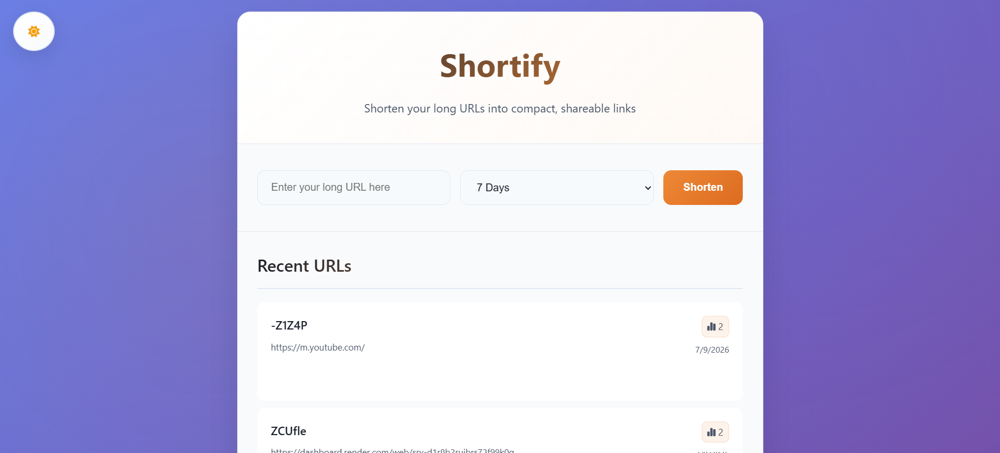
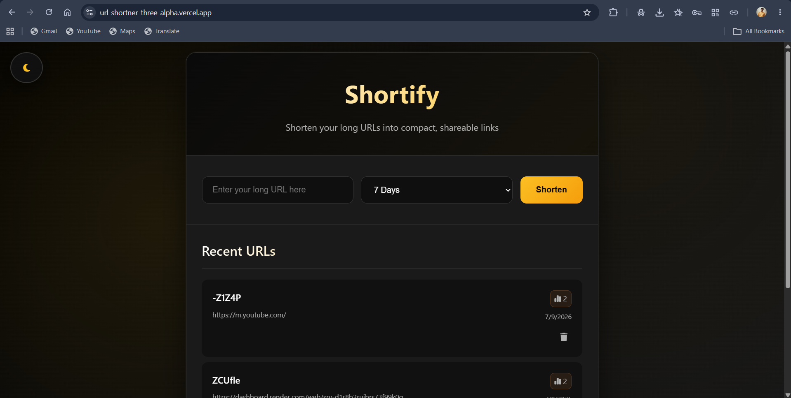
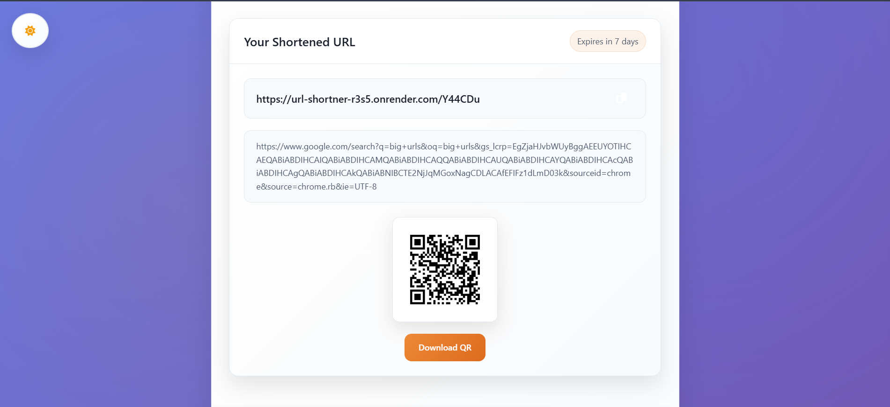
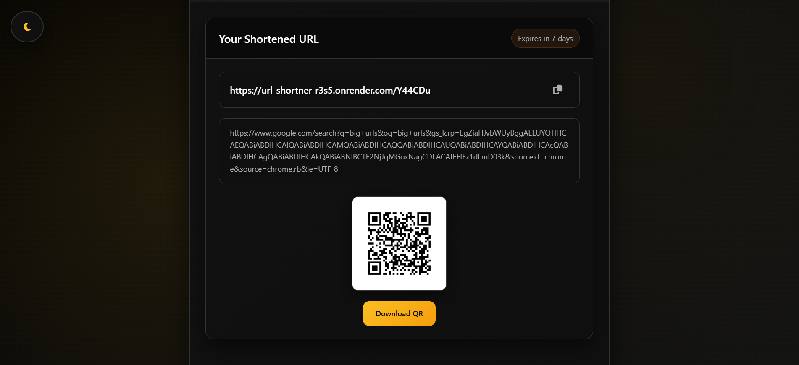

<div align="center">

# 🚀 Shortify

### Modern Full-Stack URL Shortener with QR Code Generation & Click Analytics

Transform long URLs into compact, shareable links with QR code generation, expiration management, click tracking, and a beautiful responsive interface.

<br>

[](https://url-shortner-three-alpha.vercel.app/)
[](https://github.com/Tilak2729/Url-Shortner)


</div>

---

# 📖 Overview

**Shortify** is a full-stack URL shortening platform that enables users to convert long URLs into compact, shareable links. Along with shortening URLs, the application automatically generates downloadable QR codes, tracks click analytics, supports URL expiration, and provides an intuitive history dashboard.

The project is built using **Node.js**, **Express.js**, **MongoDB Atlas**, and **Vanilla JavaScript**, with deployment on **Render** and **Vercel**.

---

# 🌐 Live Demo

### 🔗 Website

https://url-shortner-three-alpha.vercel.app/

### 💻 GitHub Repository

https://github.com/Tilak2729/Url-Shortner

---

# ✨ Features

- 🔗 Generate short URLs instantly
- ⚡ NanoID-based unique URL generation
- 📱 Automatic QR Code generation
- ⬇ Download QR Code as image
- 📊 Click analytics
- 🕒 Configurable URL expiration
- 📜 URL history dashboard
- 🗑 Delete shortened URLs
- 📋 One-click copy functionality
- 🌙 Dark Mode
- ☀ Light Mode
- 📱 Responsive Design
- ☁ MongoDB Atlas cloud database
- 🚀 Fully deployed using Vercel & Render

---

# 📸 Screenshots

## Home Page (Light Mode)

<p align="center">

</p>

---

## Home Page (Dark Mode)

<p align="center">

</p>

---

## Generated Short URL & QR Code (Light Mode)

<p align="center">

</p>

---

## Generated Short URL & QR Code (Dark Mode)

<p align="center">

</p>

---

# ⚙ Tech Stack

## Frontend

- HTML5
- CSS3
- Vanilla JavaScript

## Backend

- Node.js
- Express.js

## Database

- MongoDB Atlas
- Mongoose

## Deployment

- Vercel
- Render

## Libraries Used

- NanoID
- QRCode
- Dotenv
- CORS

---

# 🏗 Project Architecture

```
                User
                  │
                  ▼
        Frontend (Vercel)
                  │
                  ▼
          Express REST API
                  │
                  ▼
          MongoDB Atlas Cloud
                  │
                  ▼
        Short URL + QR Code
                  │
                  ▼
             User Response
```

---

# 📂 Folder Structure

```
Url-Shortner
│
├── backend
│   ├── models
│   ├── routes
│   ├── public
│   ├── server.js
│   ├── package.json
│   └── ...
│
├── frontend
│   ├── index.html
│   ├── styles.css
│   ├── script.js
│   └── ...
│
├── assets
│   ├── home-light.png
│   ├── home-dark.png
│   ├── qr-light.png
│   └── qr-dark.png
│
└── README.md
```

---

# 🚀 Getting Started

## Clone Repository

```bash
git clone https://github.com/Tilak2729/Url-Shortner.git

cd Url-Shortner
```

---

## Install Backend Dependencies

```bash
cd backend

npm install
```

---

## Run Backend

```bash
npm start
```

---

## Run Frontend

Open the frontend directory and launch the application using Live Server or any static server.

---

# 🔐 Environment Variables

Create a `.env` file inside the backend directory.

```env
MONGO_URI=your_mongodb_connection_string

BASE_URL=http://localhost:5000

FRONTEND_URL=http://localhost:3000

PORT=5000
```

---

# 📡 API Endpoints

| Method | Endpoint | Description |
|----------|-------------------|----------------------------|
| POST | `/api/shorten` | Create Short URL |
| GET | `/api/urls` | Fetch URL History |
| DELETE | `/api/url/:id` | Delete URL |
| GET | `/:code` | Redirect to Original URL |

---

# 📊 Core Functionalities

### URL Shortening

Creates compact, shareable links using NanoID.

---

### QR Code Generation

Automatically generates QR Codes for every shortened URL and allows downloading.

---

### Click Tracking

Tracks the number of visits made using each shortened URL.

---

### URL Expiration

Supports configurable expiration periods to automatically invalidate links.

---

### History Management

Displays previously shortened URLs with creation date and click statistics.

---

### Dark & Light Theme

Allows users to switch between themes for an enhanced user experience.

---

# 🧠 Challenges Faced

During development, several real-world deployment and backend challenges were solved, including:

- Cross-Origin Resource Sharing (CORS) configuration
- MongoDB Atlas integration
- Environment variable management
- Render backend deployment
- Vercel frontend deployment
- Production API configuration
- URL redirection handling
- QR Code generation
- Responsive UI development

---

# 🔮 Future Improvements

- 👤 User Authentication
- ✏ Custom URL aliases
- 📈 Advanced Analytics Dashboard
- 🔒 Password Protected URLs
- 📁 User-specific URL Management
- 📊 Charts & Statistics
- ⚡ Redis Caching
- 🐳 Docker Support
- 📱 Progressive Web App (PWA)
- 🌍 Custom Domains

---

# 👨‍💻 Author

**Tilak Bhandari**

Electrical Engineering Undergraduate  
Motilal Nehru National Institute of Technology Allahabad (MNNIT)

GitHub: https://github.com/Tilak2729

---

# ⭐ Support

If you found this project useful, consider giving it a ⭐ on GitHub.

---

<div align="center">

### Built using Node.js, Express.js, MongoDB Atlas & JavaScript

</div>